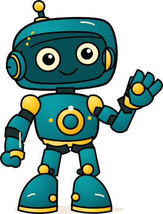

<p align="center">
  <br><br>
  
</p>

<p align="center"><strong>Every O-Matic plugin, one catalog.</strong><br>
The research lab, in your terminal.</p>

<p align="center">
  
  
  
  <a href="https://o-matic.ai"></a>
</p>

---

## What's O-Matic?

O-Matic is a research lab building **Human-Cyber Work Teams** — people and AI working the same problem, each bringing what they're good at. You bring vision, judgment, and taste. The machine brings memory, speed, and tireless execution. Together you're better than either one alone.

We ship that idea as **factories**. A factory is an *Artificial Organization*: a roster of skills and agents that share memory, governance, and a job to do. This marketplace is where you pick up the parts.

> **Build the universe. Keep the robot.**

## Add the marketplace

```
claude plugin marketplace add lucidIT-LLC/o-matic-marketplace
```

## Meet the roster

| Plugin | Install | Who shows up |
|---|---|---|
| **omatic-server-connection** | `omatic-server-connection@o-matic.ai` | The connection to an O-Matic Server — and **Probot** (orchestrator), **Fred** (files + connections), **Data** (analyst + DBA). |
| **o-matic-wordpress-factory** | `o-matic-wordpress-factory@o-matic.ai` | Brand, build, write, ship websites — **Brandy, Carver, Monet, Jo** + live WordPress &amp; Elementor connectors. |
| **smith** | `smith@o-matic.ai` | **Critical Analyst.** Stress-tests the plan before reality does. Cold, surgical, fair. |
| **jo** | `jo@o-matic.ai` | **Writing Coach.** Structure, voice, the works. |
| **tim** | `tim@o-matic.ai` | **Tool Optimizer.** Audits your MCP connectors and tells you what you actually have. |
| **rimmer** | `rimmer@o-matic.ai` | **Agent Evaluator.** Evidence-first evals for skills and agents. |

Install any one:

```
claude plugin install smith@o-matic.ai
```

## Self-contained

Every plugin lives in this one repo — no external git-subdir references, each with its own version. `jo` is canonical here and bundled into the WordPress Factory; `scripts/sync-shared-skills.mjs --check` keeps those copies identical. (The O-Matic Server container ships separately at `lucidIT-LLC/o-matic-server-container` — that's infra, not a plugin.)

## Shared Skills

Jo is a shared skill. Install standalone `jo` for writing-only work, or install `o-matic-wordpress-factory` when the WordPress/Elementor workflow should also bring Jo with Brandy, Carver, and Monet. In Codex, do not enable both providers at the same time unless you are explicitly auditing same-signature behavior; otherwise the UI will show duplicate Jo entries even when the two files are byte-identical.

Before release or reinstall, run:

```
node scripts/sync-shared-skills.mjs --check
node scripts/audit-installed-skill-duplicates.mjs
```

## Under the hood

Catalog manifests: `.claude-plugin/marketplace.json` (Claude Code) and `.agents/plugins/marketplace.json` (Codex parity). Host-neutral adapters (Codex, Gemini, Ollama) and `agent-pack.json` live alongside for non-Claude hosts.

---

<p align="center">
  Built by <a href="https://github.com/lucidIT-LLC">lucidIT-LLC</a> · <a href="https://o-matic.ai">o-matic.ai</a><br>
  <em>Technology should make people more capable, not more replaceable.</em>
</p>
